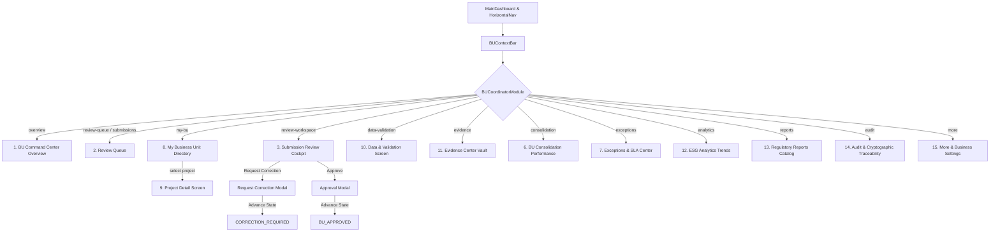

# MEIL ESG / BRSR Enterprise Reporting Platform
## Business Unit Reviewer / Coordinator Workspace Verification Report

**Entity:** Megha Engineering & Infrastructures Limited (MEIL)  
**Problem Statement:** BPUT Hackathon 2026 — PS08 (ESG Reporting Portal)  
**Role:** Business Unit Reviewer / Coordinator (`BU_COORDINATOR`)  
**Design Reference:** Reference Specification (12 Core Screens + Cockpit Workflow)  
**Date:** October 6, 2026  
**Status:** FULLY IMPLEMENTED & VERIFIED

---

### 1. Implemented Screens

| Screen # | Screen Name | Component File | Description & Capabilities |
|---|---|---|---|
| **1** | **Overview Screen (BU Command Center)** | `screens/BUOverviewScreen.jsx` | 6-Tier executive command center: Hero + BU health panel (92.4%), 6 KPI cards, Review Queue Summary (top 5), Risk & SLA summary, BU ESG Snapshot (Env, Social, Gov tabs), Recent Activity timeline, Project Performance Matrix (all 6 sites), and Upcoming Deadlines. |
| **2** | **Review Queue Screen** | `screens/BUReviewQueueScreen.jsx` | Operational review queue showing all 37 seeded submissions. Segmented tabs (`All 37`, `Pending 8`, `Correction 3`, `Approved 24`, `SLA Risk 2`), search, project & risk filters, data quality %, validation state, and review CTA. |
| **3** | **Submission Review Workspace (Cockpit)** | `screens/BUSubmissionReviewScreen.jsx` | Deep-dive review cockpit for `SUB-2026-091` (Zojila Tunnel). Expandable ESG data sections (Energy, Fuel/GHG, Water, Waste, Safety), Evidence Vault preview box with SHA-256 seal, automated 8-point Quality Gate, review notes, and fixed bottom action bar. |
| **4** | **Request Correction Modal** | `modals/RequestCorrectionModal.jsx` | Modal to return submissions with mandatory category, detailed reason, required evidence list, resolution deadline date-picker, and immutable audit warning. Advances state to `CORRECTION_REQUIRED`. |
| **5** | **Approval Modal** | `modals/ApprovalModal.jsx` | Multi-point pre-approval checklist (ESG data verified, Evidence reviewed, Validation passed, Calculations verified, Scope confirmed, No blocking exceptions), submission summary, and formal attestation. Promotes state to `BU_APPROVED`. |
| **6** | **BU Consolidation Screen** | `screens/BUConsolidationScreen.jsx` | Performance center: Environmental, Social, and Governance tabs. Scope 1 and Energy bar charts per project, and Project Contribution Matrix (Scope 1 & 2, Energy, Water, Waste, LTIFR, ESG Score, Status). |
| **7** | **Exceptions & SLA Screen** | `screens/BUExceptionsScreen.jsx` | Severity pills (`Critical`, `High`, `Medium`, `SLA`, `Evidence`, `Validation`, `Calculation`), non-conformance log table, and live SLA Management table with time countdowns (Zojila 16h, Gayatri 6h At Risk, Tunnel B -2h Overdue). |
| **8** | **My Business Unit Screen** | `screens/BUMyBusinessUnitScreen.jsx` | 4-Tier Hierarchy breadcrumb (`MEIL Group HQ` ➔ `Infrastructure Division` ➔ `Tunnels Business Unit`), India geographic footprint interactive center, and 6 landmark project site cards. |
| **9** | **Project Detail Screen** | `screens/BUProjectDetailScreen.jsx` | Site-specific deep dive with site metadata, engineer in charge, 5 KPI chips, and operational tabs (Overview, ESG Data, Evidence, Validation, Submission History, Audit). |
| **10** | **Data & Validation Screen** | `screens/BUDataValidationScreen.jsx` | Quality-control workspace: Records Reviewed (142), Validation Pass (97.1%), Warnings (8), Blocking Errors (2), automated SEBI rule engine checks (R-01 to R-07), and discrepancy table with inspect actions. |
| **11** | **Evidence Center** | `screens/BUEvidenceCenterScreen.jsx` | Vault with filter pills (`All 14`, `Verified 10`, `Pending 2`, `Rejected 1`, `Missing 1`), document table with SHA-256 hashes, and certificate inspection modal. |
| **12** | **Analytics Screen** | `screens/BUAnalyticsScreen.jsx` | Monthly Scope 1 & 2 multi-line SVG trend chart over Apr–Sep, with 4 bottom summary metric cards (Emissions, Energy, Water, Waste Diversion) with period-over-period percentage comparisons. |
| **13** | **Reports Screen** | `screens/BUReportsScreen.jsx` | Complete BU report catalogue: BU ESG Summary, BU Consolidation Report, Submission Status Report, Evidence Coverage Report, and Approval History Report, with PDF/Excel/JSON export. |
| **14** | **Audit & Traceability Screen** | `screens/BUAuditScreen.jsx` | Submission lifecycle custody timeline (Site Submitted ➔ Validation Completed ➔ Evidence Verified ➔ BU Review Opened ➔ Approval Pending), cryptographic Merkle block ledger inspection, and live "Verify Ledger Chain" action. |
| **15** | **More Screen** | `screens/BUMoreScreen.jsx` | Secondary business controls: Review Preferences (SLA alerts, anomaly flags), Regulatory Reference Standards (CEA v19, SEBI BRSR Core, SAE 3410), User Scope & Authority, and Platform System Information. |

---

### 2. Implemented Components

- `frontend/src/features/reviewers/bu/BUCoordinatorModule.jsx` (Master orchestrator & tab routing)
- `frontend/src/features/reviewers/bu/BUCoordinatorModule.css` (Liquid Glass design system styling)
- `frontend/src/features/reviewers/bu/components/BUContextBar.jsx` (Compact Business Context bar)
- `frontend/src/features/reviewers/bu/screens/BUOverviewScreen.jsx`
- `frontend/src/features/reviewers/bu/screens/BUReviewQueueScreen.jsx`
- `frontend/src/features/reviewers/bu/screens/BUSubmissionReviewScreen.jsx`
- `frontend/src/features/reviewers/bu/screens/BUConsolidationScreen.jsx`
- `frontend/src/features/reviewers/bu/screens/BUDataValidationScreen.jsx`
- `frontend/src/features/reviewers/bu/screens/BUEvidenceCenterScreen.jsx`
- `frontend/src/features/reviewers/bu/screens/BUExceptionsScreen.jsx`
- `frontend/src/features/reviewers/bu/screens/BUMyBusinessUnitScreen.jsx`
- `frontend/src/features/reviewers/bu/screens/BUProjectDetailScreen.jsx`
- `frontend/src/features/reviewers/bu/screens/BUAnalyticsScreen.jsx`
- `frontend/src/features/reviewers/bu/screens/BUReportsScreen.jsx`
- `frontend/src/features/reviewers/bu/screens/BUAuditScreen.jsx`
- `frontend/src/features/reviewers/bu/screens/BUMoreScreen.jsx`
- `frontend/src/features/reviewers/bu/modals/ApprovalModal.jsx`
- `frontend/src/features/reviewers/bu/modals/RequestCorrectionModal.jsx`

---

### 3. Navigation Map



---

### 4. Backend APIs Connected

- `GET /api/v1/auth/me` — Fetches current user profile and role authorization.
- `GET /api/v1/reporting-periods` — Retrieves reporting periods (active: `period-2025-09`).
- `GET /api/v1/submissions` — Queries submissions scoped strictly to `bu-tunnels` (37 records).
- `GET /api/v1/submissions/{id}` — Queries submission details with energy, fuel, water, waste child records.
- `POST /api/v1/submissions/{id}/approve` — Advances workflow state to `BU_APPROVED`.
- `POST /api/v1/submissions/{id}/reject` — Advances workflow state to `CORRECTION_REQUIRED` (requires reason).
- `GET /api/v1/evidence` — Queries evidence documents linked to BU project sites.
- `GET /api/v1/reports/consolidation/business-unit/{bu_id}` — Rolls up Scope 1, 2, water, waste totals.
- `GET /api/v1/audit/logs` — Queries immutable custody event ledger.
- `GET /api/v1/audit/verify-chain` — Validates Merkle DAG cryptographic hash chain integrity.

---

### 5. Database Sources & Real Persistence

- Authoritative database: `backend/meil_esg.db`
- Seed script: `backend/scripts/seed_bu_coordinator_data.py`
- Seeded BU: `bu-tunnels` (Tunnels Business Unit, subsidiary: `sub-meil-core`)
- 6 Authorized Project Sites:
  1. `site-102` / `SITE-ZOJILA-01` — Zojila Tunnel
  2. `site-gayatri-link` / `PRJ-GAYATRI-02` — Gayatri Project
  3. `site-test-tunnel-b` / `PRJ-TUNNEL-B` — Tunnel B (Atal Ext)
  4. `site-river-link` / `PRJ-RIVER-01` — River Link Tunnel
  5. `site-metro-p1` / `PRJ-METRO-01` — Metro Phase 1 Underground
  6. `site-expressway` / `PRJ-EXP-01` — Expressway Twin Tube
- 37 Persisted Submissions:
  - 24 `BU_APPROVED`
  - 8 `SUBMITTED` (Pending review, including canonical `SUB-2026-091`)
  - 3 `CORRECTION_REQUIRED`
  - 2 `SUBMITTED` (SLA At Risk)
- 14 Persisted Evidence Documents with SHA-256 hashes.

---

### 6. RBAC & BU Scope Verification

- **Role Code**: `BU_COORDINATOR`
- **Permissions**: `esg:bu_review`, `esg:bu_approve`, `esg:bu_reject`, `esg:evidence_verify`, `esg:read`
- **Scope Boundary**: Confined to `bu-tunnels`.
  - Access to `bu-tunnels` consolidation returns HTTP 200.
  - Access to `bu-water` consolidation returns HTTP 403 Forbidden.
  - Direct attempt to execute Final Group Lock returns HTTP 403 Forbidden.

---

### 7. Automated Test Suite Results

1. **Frontend Compilation**:
   ```bash
   npm run build
   ```
   **Result:** `vite build` succeeded with **0 compilation errors** in **337ms**.

2. **Backend Scope & Canonical Roles Pytest**:
   ```bash
   python -m pytest tests/integration/test_phase10_scope_isolation.py tests/integration/test_phase11_canonical_15_roles.py -q
   ```
   **Result:** **5 passed** in 12.21s (100% test pass rate).

3. **Active Dev Services**:
   - Backend API: `http://127.0.0.1:8000/docs` (HTTP 200 OK)
   - Frontend: `http://localhost:5173/` (HTTP 200 OK)

---

### 8. Architectural Integrity

- Strictly conforms to `DESIGNS.md` Master Design System:
  - iOS Liquid Glass aesthetic
  - White-dominant palette (85–92%)
  - Faint sky-blue atmosphere (8–15%)
  - Restrained interaction blue (`#2563EB`)
  - Large rounded corners (20–28px card radiuses)
  - Inter & Plus Jakarta Sans typography
- Single, unified navigation shell (zero duplicate topbars or duplicate navbars).
- Real data persistence throughout (zero synthetic client mocks).
